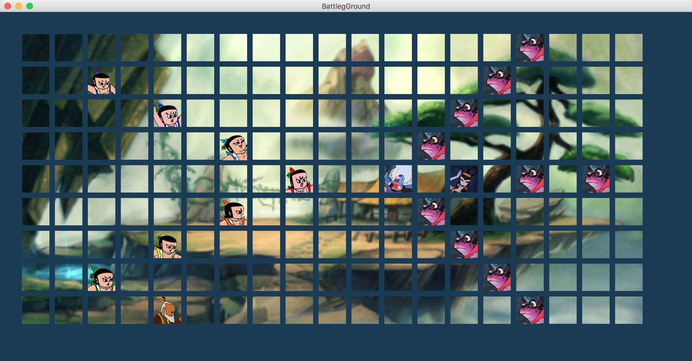
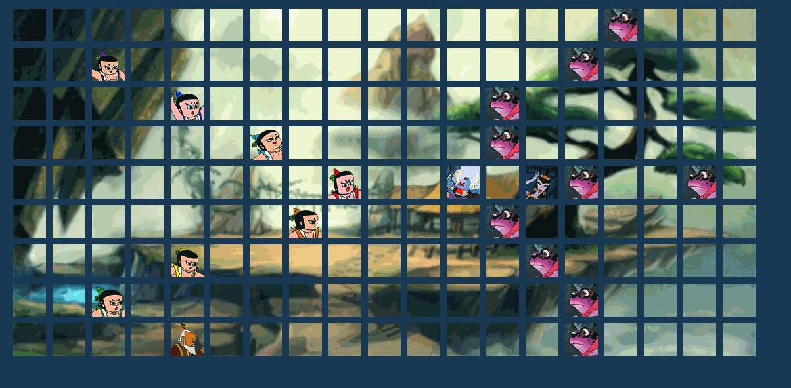
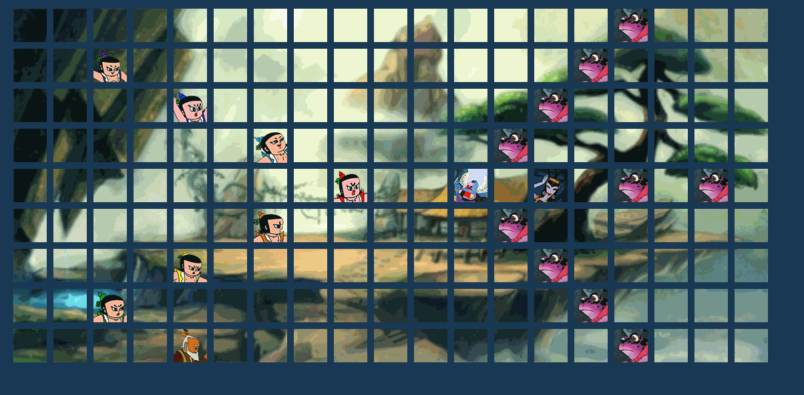

# Final Project *Huluwa*
### 一、程序运行
Run Main.main()
按**空格键**使游戏开始 **S键**保存结果 **L键**replay整个战斗过程
### 二、游戏重放
按下R键并选择out.txt文件进行回放游戏，可以选择不同的文件回放不同的战斗；
重放相当于有一个God按照文件中的内容对葫芦娃和妖怪的走位进行操作并决定生死。
### 三、类以及算法
Figure extends Thing2D：所有人物的父类
Huluwa extends Figure：葫芦娃
Yaoguai extends Figure：妖怪
God：以上帝视角记录战斗的过程并重放游戏
Field：包含了寻找最近的敌人，移动自己的位置，更新战斗状态，死亡等方法
Thing2D：所有人物的父类
Hulu：葫芦娃以及妖怪的载体
Sorter：所有排序算法的父类
Louluo&Shejing：妖精以及蛇精 
#### 多线程协同
每一个葫芦娃和妖怪都是一个单独的线程，程序运行后所有线程开始运行，并通过lock()来确保每一次只有一个线程进行移动，当一方全部死亡后，线程终止，游戏结束；重新开始游戏使得所有线程被终止。
### 四、人物行为
葫芦娃和妖怪有类似的行为：
##### 1. 移动到一个指定位置（charge）
##### 2. 寻找距离自己最近的敌人（FindHl FindYg）
寻找到距离最近的敌人后可以移动一个单位，当双方移动到距离小于一定值时发生战斗，并以一个固定的概率决定哪方死亡
##### 3. 死亡退出战斗（die）
### 五、战斗画面
葫芦娃以鹤翼布阵，爷爷在下方指挥；妖怪以锋矢布阵，由蝎子精率领。

### 六、设计思想
#### 里氏替换：在类的继承关系上，子类严格实现父类的函数，理论上子类的实例可以完全替代所有超类的实例。

#### 接口隔离：人物和比较行为都定义了接口，由具体的类实现。

### 六、感想
这次写大作业最大的感受就是如果想要做出一个好的游戏或者其它作品出来，就必须付出时间和心意。这次由于这两天考试压力大，没有达到我最终的期望，寒假一定要把它继续完善下去，达到我想要的结果。

